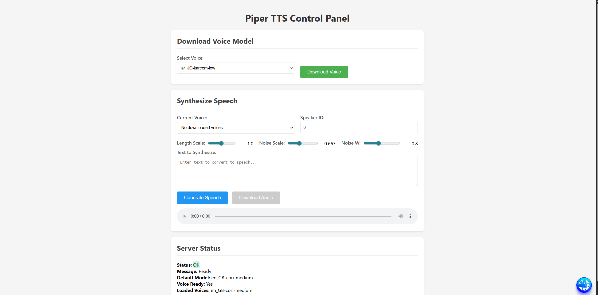
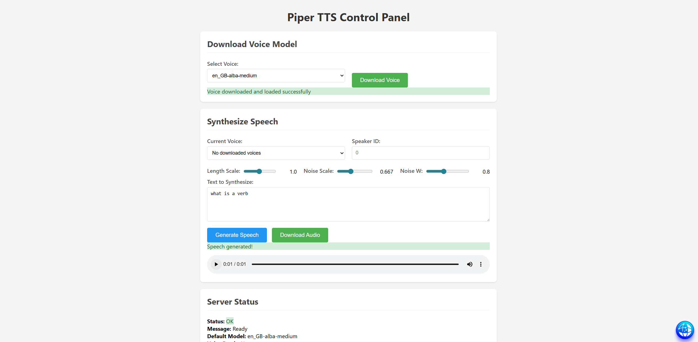

# Audio PDF Reader

PDF Audiobook Reader and Oral Quiz Assistant, powered by [Piper TTS](https://github.com/rhasspy/piper).

## Screenshots

### PDF Reader



### Reader Controls



## Features

- **PDF Reader** (`app.py`): Upload or load PDFs from server, page-by-page with image preview
- **Text-to-Speech**: via self-hosted Piper TTS service
- **Page Navigation**: Next/prev, first/last, direct page input, chapter/bookmark navigation
- **Voice Commands**: Hands-free control via browser microphone (Web Speech API)
- **OCR Support**: Tesseract OCR for scanned/image PDFs
- **Speed Control**: Adjust reading speed 0.5x–2.0x
- **Sync Highlighting**: Word-by-word highlighting synchronized with audio playback
- **Audio Download**: Export pages as WAV files
- **PDF Tutor** (`pdf_tutor.py`): Oral quiz assistant — loads Q&A from PDFs/Excel and quizzes you via TTS

## Quick Start

### Local (no Docker)

```bash
pip install -r requirements.txt
# Start the Piper TTS server separately, then:
streamlit run app.py --server.address=0.0.0.0 --server.port=8501
# PDF Tutor on port 8502:
streamlit run pdf_tutor.py --server.address=0.0.0.0 --server.port=8502
```

### Docker Compose

```bash
docker compose up --build
```

Services:
| Service | URL |
|---------|-----|
| PDF Reader | http://localhost:8501 |
| PDF Tutor | http://localhost:8502 |
| Piper TTS API | http://localhost:5000 |

## Configuration

All settings are controlled via environment variables (see `docker-compose.yml`):

| Variable | Default | Description |
|----------|---------|-------------|
| `TTS_BASE_URL` | `http://localhost:5000` | Piper TTS service URL |
| `LLM_ENABLED` | `false` | Enables optional Ollama integration for fallback chat/voice replies |
| `LLM_BASE_URL` | `http://localhost:11434` | Ollama LLM URL (optional) |
| `LLM_MODEL` | *(unset)* | Model name for your chosen LLM backend; required only when LLM is enabled |
| `TESSERACT_PATH` | *(system)* | Path to Tesseract binary (Windows) |
| `TTS_MAX_CHARS` | `10000` | Max characters per TTS request |
| `PDF_RENDER_ZOOM` | `1.6` | PDF page render zoom factor |

LLM support is optional and disabled by default. If you enable it, set `LLM_MODEL` to the model name your configured backend expects. Do not use container image references like `"docker.io/ai/qwen3-coder:latest"`.

## Voice Commands

Prefix commands with "pdf":
- `pdf next` / `pdf back` — page navigation
- `pdf page 5` — go to page 5
- `pdf go chapter 2` — jump to chapter
- `pdf read` — generate audio for current page
- `pdf speed 1.5` — set reading speed

## Project Structure

```
.
├── app.py              # Streamlit PDF Reader
├── pdf_tutor.py        # Streamlit Oral Quiz Assistant
├── piper_ui.py         # FastAPI Piper TTS server
├── Dockerfile          # PDF Reader + Teacher image
├── Dockerfile.tts      # Piper TTS image
├── docker-compose.yml  # Full stack orchestration
├── requirements.txt    # PDF Reader dependencies
├── requirements.tts.txt# TTS server dependencies
├── data/               # Voice model files (.onnx) — gitignored
├── models/             # Extra model files — gitignored
└── templates/          # HTML templates
```

## License

MIT
